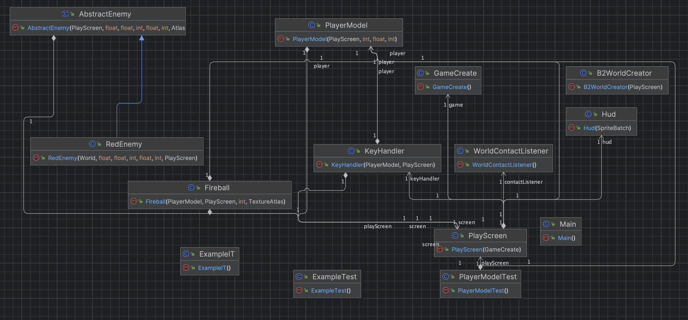

# Rapport – Innlevering 2

**Team:** Høytek Nightfall: Survivors Saga Deluxe Edition

## Teamroller
- **Magnus Fjeldstad**
  - **Rolle:** Team Lead

- **Lyder Samnøy**
  - **Rolle:** Game Designer

- **Brage Hogstad**
  - **Rolle:** Testansvarlig

- **Jens Brown Eriksen**
  - **Rolle:** Dokumentasjonsansvarlig

- **Johannes Helleve**
  - **Rolle:** Git Master

- **Henrik Tennebekk**
  - **Rolle:** Co-Team Lead

## Hvordan fungerer rollene i teamet?

Vi opplever at rollene i teamet fungerer ganske greit. Vi har satt faste rammer og forventninger til hvilke arbeidsoppgaver de forskjellige rollene skal gjøre. I starten var det litt overveldene å sette seg inn i nye verktøy som å bruke GIT i et team, men det har kommet seg veldig over de siste ukene. På møte 05.03 (Se referat), kom vi frem til at for dem som ikke har programmert så mye er det vanskelig å sette seg inn i prosjektet ettersom det begynner å bli ganske omfattende med mange klasser og logikk.

## Trenger vi nye roller?
Vi kunne trengt en person som tar litt ansvar for fordeling av arbeidsoppgaver ettersom det er vanskelig å vite hva man skal gjøre. Dette ansvaret har vi gitt til Magnus og Henrik ettersom det er de som har programmert mest og kjenner prosjektstrukturen best. 

### Hvilke erfaringer har vi fått i henhold til å være et team?
Vi har tatt et utgangspunkt i en Scrumban metodikk som vi har hatt litt trøbbel med å opprettholde. Nå som vi er kommet bedre i gang med selve prosjektet så går ting mer radig og konkrete arbeidsoppgaver blir fordelt og fullført. Vi har gått litt unna

## Prosjektverktøy
Vi bruker trello til kanban. Også bruker vi Libgdx og Box2d for spillimplementasjon. Vi bruker Tiled for å lage mappet.

## Hvordan fungerer gruppedtynamikk og kommunikasjon?
Gruppen kommer godt overens og mye tid blir brukt på å drøfte forskjellige ideer og implementasjoner til prosjektet. Vi møtes fysisk 1-2 ganger i uken, men er også aktive på messenger og discord. Vi håper dette fører til økt fleksibilitet mtp. fordeling av arbeidsoppgaver. Vi føler at alle i gruppen er engasjerte og kommer med gode innspill, noe som fører til et godt arbeidsmiljø.

## Kort retrospektivt om hva som er bra og hva som kan forbedres
Hittil har det vært noen på gruppen som har hatt kontroll på det administrative, mens andre har hatt kontroll på koden. Dette har ført til at det har vært vanskelig for alle å få til noe arbeid på koden for egenhånd. Dette har ikke vært optimalt ettersom det fører til at noen skriver koden mens andre legger planer for den. Etterhvert som kodebasen vokser, vil det også bli vanskeligere å lære seg hvordan den henger sammen. 

## Nevn tre forbedringspunkter som skal følges opp
1. Alle skal lære seg og forstå kodebasen. Hittil har det vært et problem at det er vanskelig å finne små oppgaver som lar lagmedlemmene jobbe med kodebasen. Nå dukker det opp flere lette oppgaver som gjør det lettere for alle å jobbe med koden. Vi ønsker at alle skal kunne jobbe med koden og bli kjent med den. 
2. Alle skal forstå og ta i bruk kanban aktivt. Nå som vi har kommet et stykke er det lettere å finne oppgaver som må gjøres, noe som gjør det lettere å ta i bruk kanban på en god måte. Vi ønsker at alle skal komme inn i en god flyt og få til å gjøre oppgaver fra kanbantavlen på egenhånd.
3. Alle skal lære seg libGDX bedre. Hittil har mye av koden blitt skrevet på en måte som funker, men som ikke er optimalt for bruk med libGDX. Dersom vi lærer oss rammeverket bedre, vil vi få bedre kode som er lettere å jobbe med og debuge.

## Krav og Spesifikasjoner
Nedenfor er de samme MVP-kravene vi oppførte i begynnelsen av prosjektet. Hittil kan vi krysse av samtlige, men har fremdeles litt å strekke oss etter.

1. Spilleren får presentert en forside med en stor overskrift og musikk spilles for å skape en stemning. Samtidig finnes det en knapp for instruksjoner og å starte spillet. 

2. Når spilleren trykker på spill viser skjermen et spillbrett hvor spillerens karakater står i midten.

3. Spilleren kan flytte karakteren ved hjelp av tastaturet.

4. Spilleren kan bevege seg med terrenget som har effekter på karakteren.

5. Fiender blir konstruert utenfor skjermen og beveger seg mot spilleren.

6. Spilleren kan angripe fiender og fiender kan angripe spilleren.

7. Spilleren kan plukke opp power ups som gir spilleren en kortvarig fordel.

7. Spilleren får poeng for å drepe fiender.

8. Spilleren har en gitt mengde liv og mister liv når fiender angriper/kommer i kontakt med spilleren.

9. Etter ett antall fiender er drept skal spilleren få en meny som viser ulike oppgraderinger spilleren kan velge mellom.

10. Når spilleren mister alle livene sine, vises en skjerm som viser at spillet er over og en mulighet for å starte spillet på nytt.

Mange av disse punktene er halvveis gjort. For eksempel har vi et spillbrett, men at karakteren ikke begynner i midten. Vi har også laget fiende, men er ikke ferdig med å lage en "EnemySpawner". Enn så lenge har vi konstruert en PlayerModel som kan bevege seg i 4 forskjellige retninger på spillbrettet. Forskjellige screens som start screen og pause screen er under konstruksjon, noe som kommer til å øke spillets helhet. Hit points og Collisions er også godt i gang. Spilleren selv, og skuddene karakteren avfyrer kolliderer med vegg, men vi mangler implementasjon av kollisjon med fiende. 

## Bugs
- Siden mange av MVP kravene er halvveis ferdig, finnes det flere bugs. Programkræsj ved forsøk å komme til pausemeny, fiende som får en enorm akselerasjon ved treff av fireball og diagonal bevegelse som er raskere enn horisontal og vertikal. Dette er småting som naturligvis kan og skal fikses.

## Prioriteringer fremover
- Å fullføre MVP er hovedprioritet. Det å få spawner in enemies som kan gjøre skade på spilleren og at spilleren kan drepe fiender er noe av det som står øverest. Når det er i boks, sammen med startskjerm og pauseskjerm begynner programmet og ligne et skikkelig rouge-like spill. Noe vi har vært veldig dårlig med som må forbedres er skriving av tester. Å skrive tester parallelt med videreutvikling av selve spillet kommer til å være noe vi legger vekt på fremover. 

## Brukerhistorie, akseptansekriterier og arbeidsoppgaver
Fremover vil det bli lagt fokus på følgende
1. Som spiller ønsker jeg at fire balls gjør skade på enemy
- Akeptansekriterer
    - Fireball skal gjøre skade på enemy som er satt til en bestemt integer
    - Ved kollisjon med fiende skal tilsvarende integer som fireballen skader bli trukket fra enemy sine health points
    - Ved enemy hit points lik null skal enemy dø, og bli fjernet fra spillbrettet

- Arbeidsoppgaver
    - Lage en metode som fjerner substraherer x antall hit points som en fire ball utgjør i skade ved kollisjon

2. Som spiller ønsker jeg å ha hitpoints som minker når jeg tar skade
- Akseptanserkriterer
    - Spiller skal ha hit points som vises i form av health-bar på skjermen
    - Hit points oppdateres i henhold til skade spilleren tar
    - Spilleren skal dø ved hit points lik null

- Arbeidsoppgaver
    - Legge inn healthbar som viser hit points til spiller
    - Angi at hvis healt points er mindre eller lik null så dør spilleren og programmet sendes til "Game Over" skjerm
    - Lage en metode som oppdateres i henhold til hit point

3. Som spiller ønsker jeg å få opp en pausemeny ved å trykke på "ESCAPE" mens jeg spiller
- Akseptanskriterer
    - Ved å trykke på "ESCAPE" fra PlayScreen, skal man bli tatt til en Pause Screen
    - Pause Screen som er interactive med knapper som "Continue" og "Exit" til å begynne med
    - 

- Arbeidsoppgaver
    - Lage en key handler som kaller på en metode i PlayScreen
    - Metoden i Play Screen skal kalle på at screen som viser blir PauseScreen
    - Legge til knapper "Continue" og "Exit" som gjør at spiller enten blir sendt tilbake til PlayScreen, eller sendt ut til StartScreen

## Styring av spillkarakter
- Spillkarakteren styres ved bruk av 'w', 'a', 's' og 'd'
- Angriper med 'SPACE' eller 'Mouse Button 1'

## Produkt og kode:

Dette har vi fisket siden sist:

- Implementert en tekstur til spillerkarakteren med enkle animasjoner

- Et rammeverk for å legge fiender til i spillet

- Spillkarakteren kan angripe med en "fireball" som har enkel fysikk og kollisjoner

- Lagt til et object-layer i levelet for å håndtere entities og kollisjoner

## Klassediagram

