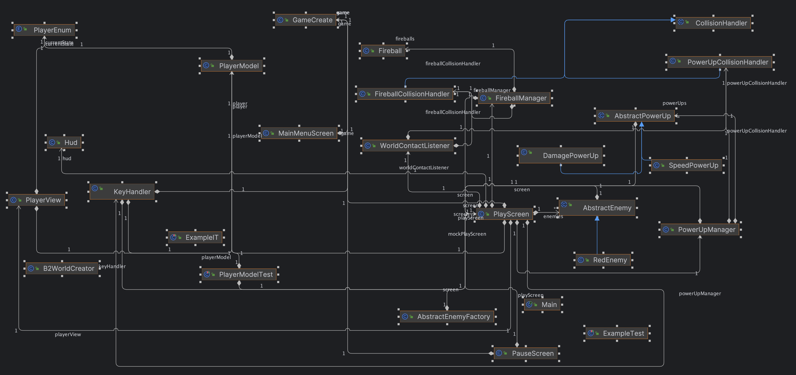

# Rapport – Innlevering 3

**Team:** Høytek Nightfall: Survivors Saga Deluxe Edition

## Teamroller
- **Magnus Fjeldstad**
  - **Rolle:** Team Lead

- **Lyder Samnøy**
  - **Rolle:** Game Designer

- **Brage Hogstad**
  - **Rolle:** Testansvarlig

- **Jens Brown Eriksen**
  - **Rolle:** Dokumentasjonsansvarlig

- **Johannes Helleve**
  - **Rolle:** Git Master

- **Henrik Tennebekk**
  - **Rolle:** Co-Team Lead

## Hvordan fungerer rollene i teamet?

Vi opplever at rollene i teamet fungerer ganske greit. Vi har satt faste rammer og forventninger til hvilke arbeidsoppgaver de forskjellige rollene skal gjøre. Ekelte innad i gruppen har større insikt i koden en andre i gruppen, likevel føler vi at vi har bedre klart å involvere alle i prosjektet. Alle har nå en god forståelse av koden vår og kan bidra med å skrive kode.

## Trenger vi nye roller?
Vi føler nå at vi har fått en god arbeidsfordeling og har ikke et umiddelbart behov for en ny rollefordeling i prosjektet. Før forrige innlevering hadde vi behov for en som tok ansvar for å oppgavetildelingen innad i gruppen. Dette ansvar tok Magnus og Henrik på seg, og det har fungert veldig bra.

### Hvilke erfaringer har vi fått i henhold til å være et team?
Siden sist innelvering har vi endret en god del på hvordan vi samarbeider. Vi hadde tidligere jevnlige korte møter, hvor vi delte oppgvaer og diskuterte prosjektet. Etterpå jobbet vi hovedsakelig individuelt eller i par med de tildelte oppgavene, distansert fra rsten av gruppen. Dette fungerte greit dersom alle arbeidsoppgaver var veldig tydelig tildelt. Likvel har vi nå hatt et ønske om at hele gruppe skal møtes oftere for å jobbe samlet over lengre tidsperioder. Vi prøver nå å være i nærheten av hverandre når vi jober på prosjektet.

## Prosjektverktøy ////
Vi bruker trello til kanban. Også bruker vi Libgdx og Box2d for spillimplementasjon. Vi bruker Tiled for å lage mappet.

Her er en lenke til trello boardet, vil glemte å ta den med i forrige oblig1 og så først nå at dere ville ha tilgang til det
https://trello.com/b/NoTT8KFC/h%C3%B8ytek-survivors

## Hvordan fungerer gruppedtynamikk og kommunikasjon?
Gruppen kommer godt overens og mye tid blir brukt på å drøfte forskjellige ideer og implementasjoner til prosjektet. Vi møtes fysisk 1-2 ganger i uken, men er også aktive på messenger og discord. Vi håper dette fører til økt fleksibilitet mtp. fordeling av arbeidsoppgaver. Vi føler at alle i gruppen er engasjerte og kommer med gode innspill, noe som fører til et godt arbeidsmiljø.

## Kort retrospektivt om hva som er bra og hva som kan forbedres
Hittil har det vært noen på gruppen som har hatt kontroll på det administrative, mens andre har hatt kontroll på koden. Dette har ført til at det har vært vanskelig for alle å få til noe arbeid på koden for egenhånd. Dette har ikke vært optimalt ettersom det fører til at noen skriver koden mens andre legger planer for den. Etterhvert som kodebasen vokser, vil det også bli vanskeligere å lære seg hvordan den henger sammen. 

Vi føler nå i løpet av de siste ukene at flere på gruppen har kommet mer inn i prosjektet. Vi har hatt en mer intensiv periode rett før påske da alle gjorde en ekstra insats for å få fart på prosjektet. Likevel er vi nok fortsatt preget av ulike kunnskap av vår egen kode. Dette er noe vi ønsker å fortsette å forbedre, men er vansklig å perfeksjonere når vi er 6 gruppemedlemmer, alle med forskjellige kunnskapsnivå.

Vi har nå insett at vi muligens kan ha vært litt for ambasiøse i forhold til hvor stort spillet vårt skal være. VI er derfor nødt til å gjøre enkelte prioteringer for hva vi ønsker å gå videre med, og hvilke tilskudd til spillet som vi ønsker å forkaste. Dette kommer av at dersom vi innfører alle effektene som vi først har planlagt, vil det bli et veldig stort og avansert spill, noe som vil kreve mye tid av oss dersom vi skal lage gode tester, og ha en bra struktur og dokumentasjon gjennom koden. Vi vil derfor heller forenkle ideen litt, slik at vi har et mindre, men mer ryddig og gjennomført program. 

## Nevn tre forbedringspunkter som skal følges opp

1. Vi har nå motatt tilbakemeldinger på programet vårt, og har fått en oversikt over hvor vi har forbedringspotensialet. Vi ønsker å ta tak i disse punktene og forbedre der vi kan. Et fokus vi ønsker forbedring på er kodestrukturen, hvor vi vilø legge til en større grad av abstraksjon i klassene våre. Vi vil benytte oss av grensesnitt og factories for å få en mer ryddig kodestruktur.

2. Foreløbig har vi hatt veldig lite fokus på testing av programmet vårt. Dette har vi fått stort trekk på i tilbakemeldingene, og er noe vi er nødt til å fokusere på framover. Vi ønsker å skrive tester parallelt med videreutvikling av programmet, og vil sette av tid til dette i ukene som kommer.

3. Alle skal forstå og ta i bruk kanban aktivt. Nå som vi har kommet et stykke er det lettere å finne oppgaver som må gjøres, noe som gjør det lettere å ta i bruk kanban på en god måte. Vi ønsker at alle skal komme inn i en god flyt og få til å gjøre oppgaver fra kanbantavlen på egenhånd.

## Krav og Spesifikasjoner
Nedenfor er de samme MVP-kravene vi oppførte i begynnelsen av prosjektet. Hittil kan vi krysse av samtlige, men har fremdeles litt å strekke oss etter.

1. Spilleren får presentert en forside med en stor overskrift og musikk spilles for å skape en stemning. Samtidig finnes det en knapp for instruksjoner og å starte spillet. 

2. Når spilleren trykker på spill viser skjermen et spillbrett hvor spillerens karakater står i midten.

3. Spilleren kan flytte karakteren ved hjelp av tastaturet.

4. Spilleren kan bevege seg med terrenget som har effekter på karakteren.

5. Fiender blir konstruert utenfor skjermen og beveger seg mot spilleren.

6. Spilleren kan angripe fiender og fiender kan angripe spilleren.

7. Spilleren kan plukke opp power ups som gir spilleren en kortvarig fordel.

7. Spilleren får poeng for å drepe fiender.

8. Spilleren har en gitt mengde liv og mister liv når fiender angriper/kommer i kontakt med spilleren.

9. Etter ett antall fiender er drept skal spilleren få en meny som viser ulike oppgraderinger spilleren kan velge mellom.

10. Når spilleren mister alle livene sine, vises en skjerm som viser at spillet er over og en mulighet for å starte spillet på nytt.

Vi har hatt en stor framdrift på spillet vårt i løpet av den siste tiden og har kommet et godt stykke forbi MVP. Vi har nå en spiller som kan bevege seg rundt på skjermen, angripe fiender og ta skade. Vi har laget en startskjerm og en pausemeny, i tilleg er det blitt laget en upgradescreen, som vi kan lagge til effekter hvor man oppgraderer egenskapene til brukeren.

Power ups er blitt lagt til i spillet nå. Disse spawner vilkårlige steder på mappet, og gir spilleren en midlertidig speed boost. 

VI har opprettet klasser for å håndtere kollisjoner mellom ulike komponenter i spillet. Disse kollisjonenen brukes til å håndtere år komponentene tar liv fra hverandre. Brukeren kan nå ta damage fra enemies.

## Bugs
- diagonal bevegelse går raskere en horisonatal og vertikal bevegelse. Dersom du beveger deg skått, altså trykker "w" og "d" samtidig, vil du bevege deg raskere enn om du trykker "w" eller "d" alene.

- Spilleren kan bli "trappet" av enemies. Spilleren spawner i venstre nedre hjørne av spillet. Dersom ha ikke beveger seg de første sekundene vil han bli omringet av enemies og sitte fast i hjørnet. Dette vil fikses på ved å endre spawn-location, men er ikke noe vi prioterer med det første.

## Prioriteringer fremover
- Framover ønsker vi å fokusere på hvordan spillet kan utvikle seg videre i selve spillfasen. Vi ønsker å legge til flere "waves" med enemies, med en økende vanskelighetsgrad. 

Vi har lagd en upgradescreen hvor man skla kunne oppgradere spilleren. Funksjonaliteten for å utvikle oppgraderingen 

Vi har snakket om å lage en slags score for brukeren, som teller poeng ettersom vi dreper enemies. Det er mulig i ønsker å lage en animasjon mellom waves av enemies som forklarer hvilken "runde" spillereren er på. 

Vi ønsker å jobber mer med textures i programet. Per nå mangler blant annet powerups en egen tekstur, og bruker samme som enemies. Videre ønsker vi også å forstørre mappet vårt. Dette vil nok medføre at vi må gjøre et par endringer i de andre klassene for å tilpasse et større map.

Ellers må vi fokusere på testing og endringer i kodestruktur.

## Brukerhistorie, akseptansekriterier og arbeidsoppgaver
Fremover vil det bli lagt fokus på følgende

1. Waves av enemies som representerer hver runde
- Akseptanserkriterier
    - Spilleren skal møte en ny wave av enemies etter at alle enemies i forrige wave er drept
    - Antall enemies i hver wave skal øke for hver runde
    - Enemies skal ha en økende vanskelighetsgrad for hver runde
- Arbeidoppaver
    - Lage en metode som teller antall drepte fiender.
    - Når disse fiendene er drept, skal en ny wave av enemies spawne
    - Endre enemies sine egenskaper for hver wave.

2. Oppgraderingsmeny
- Akseptanserkriterer
   - Spilleren skal mellom hver wave, få opp en meny som viser ulike oppgraderinger
   - Oppgraderinsmenyen kan brukes av spilleren for å få permanente oppgraderinger
    - Oppgraderingene skal kunne forbedre spillerens egenskaper, som for eksempel angrepskraft, helse og hastighet.
- Arbeidsoppgaver
    - Lage en metode som kan kalles på fra UpgradeScreen som oppgraderer spillerens egenskaper
    - Lage en metode som oppdaterer spillerens egenskaper i henhold til oppgraderingene
    - Lage en metode som åpner upgrademenyen basert på waves.

3. Enemies skal kunne ta liv av spilleren.
- Akseptanserkriterier
    - Spilleren skal miste liv dersom han blir truffet av en enemy
    - Spilleren skal kunne dø dersom han mister alle livene sine

- Arbeidsoppgaver
    - Lage en metode som sjekker om spilleren har kollidert med en enemy
    - Metoden skal trekke fra liv fra spilleren dersom han har kollidert med en enemy
    - Metoden skal sjekke om spilleren har mistet alle livene sine

## Styring av spillkarakter
- Spillkarakteren styres ved bruk av 'w', 'a', 's' og 'd'
- Angriper med 'SPACE' eller 'Mouse Button 1'

## Produkt og kode:

Dette har vi fisket siden sist:

- Lydeffekter

- Powerups som gir spilleren en midlertidig speed boost

- Upgradescreen

- Kollisjonshåndtering som gjør at vi kan ta damage fra hverandre

## Klassediagram

